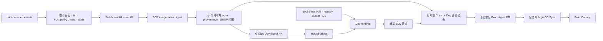
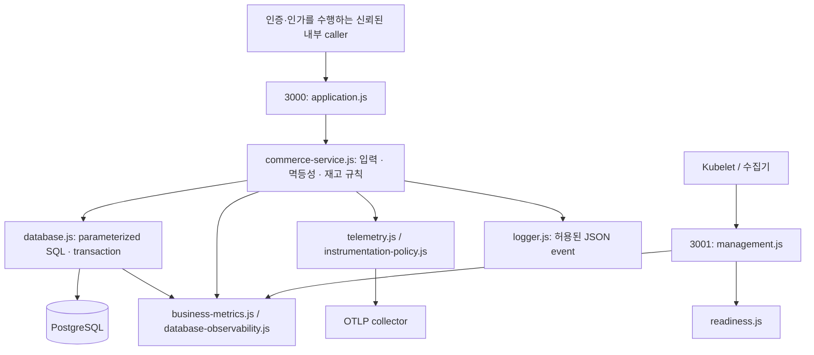
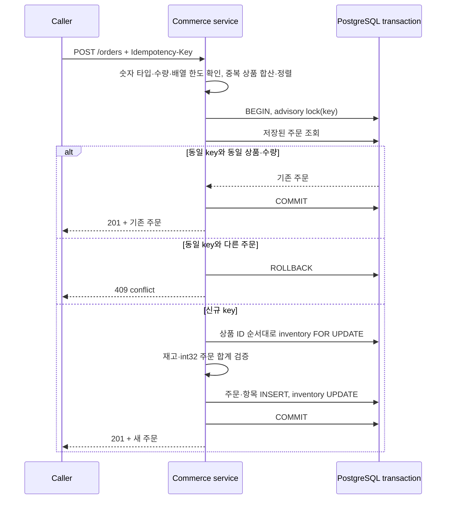

# Mini Commerce 운영 아키텍처

상품·재고·주문 규칙을 하나의 service와 하나의 PostgreSQL transaction 경계에 둡니다.
이 문서는 현재 코드가 구현한 구조를 설명합니다. EKS, ECR, Argo CD와 실제로 연결됐다는
실행 증거는 별도의 배포 기록에서 확인해야 합니다.

## 목차

- [저장소 간 책임과 전달](#저장소-간-책임과-전달)
- [런타임 데이터 흐름](#런타임-데이터-흐름)
- [주문 transaction과 호환성](#주문-transaction과-호환성)
- [신뢰 경계와 미구현 기능](#신뢰-경계와-미구현-기능)
- [코드와 폴더 탐색](#코드와-폴더-탐색)
- [운영 규모에 따른 선택](#운영-규모에-따른-선택)
- [장애와 관측](#장애와-관측)
- [발표와 검증의 구분](#발표와-검증의-구분)

## 저장소 간 책임과 전달

서비스 코드는 `mini-commerce`, 클라우드 기반은 `EKS-infra`, 배포 desired state는
`argocd-gitops`가 소유합니다. Digest는 이미지 내용의 불변 식별자이며, 환경 승격 시 다시 빌드하지 않습니다.

이 그림에서 봐야 할 핵심은 이미지 검증, 실제 Dev 실행 증거, Prod 승인이 서로 다른 gate라는 점입니다.
앱 저장소가 소유하는 것은 `.github/workflows/ci.yml`, `promote.yml`의 image 발행·검증·PR 생성까지입니다.
실제 Argo 설정, migration hook, Canary analysis, rollback은 GitOps 저장소에서 교차 검토해야 합니다.

AMD64 runner의 ARM64 build를 위해 Buildx 전에 QEMU를 명시적으로 설치합니다. Action commit과
binfmt 실행 image index digest를 모두 고정하고 실제 build 시각을 OCI metadata에 기록합니다.
실제 cross-build는 CI에서 별도로 확인해야 합니다.
[Docker의 multi-platform CI 흐름](https://docs.docker.com/build/ci/github-actions/multi-platform/).

전달 workflow는 기본 권한을 비우고 job별 read/OIDC/attestation 권한을 선언합니다. build와 attestation은
별도 Role을 사용하지만 OIDC trust가 같은 ref를 허용하면 완전한 job 간 보안 격리는 아닙니다.
Dev 자동 merge와 Prod 승인 권한도 GitHub Environment/Ruleset/App 설정이 실제로 적용돼야 유효합니다.

## 런타임 데이터 흐름

`src/runtime.js`가 의존성을 조립합니다. Business 포트와 management 포트를 분리하고
DB, metrics, logger, telemetry를 하나씩 생성합니다. HTTP handler는 SQL을 직접 작성하지 않습니다.

이 그림에서 봐야 할 핵심은 포트 분리 자체가 인증이 아니라는 점입니다. `3001`도 listener이며,
서비스·방화벽·NetworkPolicy에서 수집기와 probe 접근만 허용해야 합니다. `3000`의 접근 통제도 외부 경계가 필요합니다.

| 포트 | API | 반환 의미 |
| --- | --- | --- |
| 3000 | `GET /products` | 현재 catalog와 재고 |
| 3000 | `GET /products/:id/inventory` | 한 상품의 현재 재고 |
| 3000 | `POST /orders` | 원자적 주문 생성 또는 동일 요청 재시도 |
| 3000 | `GET /orders/:id` | DB에 저장된 주문; customer ownership 검사는 없음 |
| 3001 | `/healthz`, `/readyz` | process 생존 / 초기 의존성 검사·종료 상태 |
| 3001 | `/metrics`, `/version` | bounded metric과 build identity |

production은 DB 비활성화를 거부하고 TLS certificate verification을 켭니다. 시작 시 `display_name` 등
현재 schema를 읽는 제한된 query를 실행합니다. DB/schema/포트가 잘못되면 정리 후 실패하며, 기동 성공 이후
DB 장애는 endpoint 전체 제거 대신 503과 metric으로 관측합니다. 종료는 readiness 하강 → business drain →
pool/observer/telemetry 종료 → management 종료 순서이며, deadline 초과는 강제 연결 종료와 실패 exit로 처리합니다.

## 주문 transaction과 호환성

멱등성은 같은 요청을 다시 보내도 한 번만 효과가 발생하는 성질입니다. 이 구현은 DB unique key와
transaction advisory lock을 함께 사용하므로 여러 Pod가 같은 주문을 받아도 하나의 DB 경계에서 직렬화됩니다.

이 그림에서 봐야 할 핵심은 재고 차감과 주문 저장이 하나의 transaction이라는 점입니다.
ID 정렬은 잠금 순서를 일관되게 하고, 같은 key의 다른 payload는 기존 주문으로 오인하지 않도록 거부합니다.
키는 현재 tenant 구분이 없는 전역 namespace이며 caller가 충분히 고유하게 생성해야 합니다.

요청은 최대 100개 item entry, 상품당 합산 수량 100개, JSON 32 KiB로 제한합니다. 금액은 float가 아닌
정수 cents이고 `orders.total_cents`의 int32 범위를 초과하면 400으로 거부합니다. 새 주문과 재시도 모두
기존 OpenAPI 계약대로 201을 유지합니다. 결제 승인이나 주문 취소 API는 구현하지 않았습니다.

DB 서버의 statement/lock/idle transaction timeout과 client query timeout을 구분합니다. Client의
대기 종료만으로 서버에서 SQL이 취소됐다고 가정하지 않습니다. 실패 후 ROLLBACK까지 실패하면 해당
connection을 pool에서 제거합니다. COMMIT 응답이 끊긴 경우 결과는 모호할 수 있으므로 caller는 같은 key로 조회/재시도해야 합니다.
[pg client timeout 설명](https://node-postgres.com/apis/client).

Migration은 startup과 별도이며 적용된 파일을 수정하지 않습니다. `src/migration-plan.js`는 명시한 prefix만
선택하고, `src/migration-ledger.js`는 적용 checksum과 직렬화를 검증합니다. 002의 expand 단계에서
v1/v2 공존을 허용하고, 003의 contract는 retained rollback image가 모두 `v2prime`이라는 별도 증거가 필요합니다.
기존 001에는 예제 catalog seed가 포함돼 있으며 checksum 계약 때문에 삭제하지 않았습니다. 실제 데이터 전환은
별도 승인된 migration/data 작업으로 수행해야 합니다.

## 신뢰 경계와 미구현 기능

이 저장소에는 사용자 identity나 주문 owner 모델이 없습니다. Mesh mTLS는 workload 사이의 연결을
인증할 수 있지만, 특정 사용자가 특정 주문을 읽을 권한이 있다는 뜻은 아닙니다.

| 경계 | 현재 구현 | 실제 운영 전 필요한 결정 |
| --- | --- | --- |
| 고객 identity·주문 ownership | 없음 | 고객 직접 사용 시 인증·인가·owner schema·테스트 구현 필요 |
| 서비스 호출자 | API 자체 인증 없음 | 허용된 내부 caller만 도달하도록 ingress/mesh 정책 구성 |
| Rate limit | 앱 내 limiter 없음 | gateway에서 caller별 제한, payload·connection 예산 적용 |
| DB 권한 | TLS 검증·parameterized SQL | runtime DML 계정 / migration DDL 계정 분리, CA·secret rotation |
| Secret | log/span에 원문 body·SQL·header 미기록 | secret store·read-only mount·접근 감사 설정 |
| Build context | `.env*`, `.npmrc`, key/PEM 제외 | 운영 secret을 build arg로 전달하지 않기 |
| 공급망 | pinned base/actions, audit·scan·attestation gates | 실제 OIDC trust, ECR 정책과 Ruleset 확인 |
| 복구 | restore/invariant 검증 도구 | PITR·복구 drill, RPO/RTO 실측과 on-call 승인 |

JSON parser 오류는 body 일부를 되돌려줄 수 있으므로 고정 메시지로 변환하고 request ID만 유지합니다.
Management 오류도 raw stack 대신 고정 JSON을 반환합니다.
[Express parser 오류](https://expressjs.com/en/resources/middleware/body-parser/),
[Docker build context 경계](https://docs.docker.com/build/concepts/context/).

관리 포트 차단, 내부 API 접근 통제, 고객 ownership 요구 해결은 운영 승인 조건입니다.
이 문서만으로 인터넷 공개 서비스를 승인하거나 보안 통제가 구성됐다고 주장해서는 안 됩니다.

## 코드와 폴더 탐색

runtime 모듈을 역할에 따라 읽으면 됩니다. 같은 파일을 여러 계층 폴더로 나누거나 빈
`controllers/`, `utils/`, `services/` 구조를 추가하지 않았습니다. 한 저장소에서 변경 이유를 추적할 수 있는 규모입니다.

| 코드 묶음 | 핵심 파일과 역할 |
| --- | --- |
| 조립·환경 | `server.js`, `runtime.js`, `config.js`: 초기화 순서, 실제 listener, fail-closed 설정 |
| HTTP | `application.js`, `management.js`, `request-context.js`: route ownership·입력 경계·correlation |
| Business·영속성 | `commerce-service.js`, `database.js`: transaction 규칙과 SQL 구현 분리 |
| 생명주기 | `readiness.js`, `lifecycle.js`: startup·drain·deadline |
| 관측 | `business-metrics.js`, `database-observability.js`, `logger.js`: bounded reason/operation label |
| Trace | `telemetry.js`, `instrumentation.js`, `instrumentation-policy.js`, `register-instrumentation-hooks.js` |
| Schema | `migration-plan.js`, `migration-ledger.js`, `migrations/`, `scripts/migrate.mjs` |
| Delivery | `delivery-preflight.mjs`, supply-chain/DEV_READY/GitOps 값 도구, workflow 정의 |

`test/fixtures/`는 실패 조건 재현을 위한 입력 데이터입니다. 이 JSON을 runtime evidence로 제출할 수는
없습니다. source 문자열 검사도 SHA pin·권한·단계 의존성 같은 실행 계약에 한정해 유지하고, 문서 문구의
일치를 검사하는 테스트는 제거했습니다. `.mjs` 운영 도구도 ESLint 대상입니다.

## 운영 규모에 따른 선택

소규모 팀과 기업에서 주문 무결성·credential 보호 기준은 같습니다. 인력과 규제·가용성 요구에
따라 배포 승인·운영 기반의 복잡도를 선택하며, repo에 들어 있다는 이유만으로 모두 배포하지 않습니다.

| 관심사 | 소규모 서비스 | 조직·트래픽 확대 시 |
| --- | --- | --- |
| Application | 단일 서비스·단일 DB transaction 유지 | owner/tenant 모델, API pagination, 용량·hot-key 분석 |
| 플랫폼 | 팀이 운영 가능한 managed platform 선택 | 계정·network·workload 격리와 정책 자동화 |
| 관측 | 실패율·latency·DB 대기·복구 경보 우선 | telemetry retention·접근 감사·SLO 승인 절차 |
| 전달 | 같은 digest 승격, Prod 사람이 승인 | 환경별 App/Role, protected branch, artifact 보존 정책 |
| DB 연결 | replica × poolMax의 전체 예산 확인 | autoscale/surge/다른 서비스·migration 여유 포함 |

현재 `/products`에는 pagination이 없으며 catalog가 무한히 커지는 사용 사례에는 적합하지 않습니다.
주문 삭제·idempotency 보존기간·payment integration도 제품 정책과 함께 설계해야 합니다.
새 framework나 cache를 넣기 전에 실제 부하와 query plan으로 병목을 확인해야 합니다.

## 장애와 관측

응답 코드, request/trace ID, bounded metric을 연결해 장애 원인을 확인합니다. SQL·credential·요청 body가
없는 log는 개인정보 위험을 줄이지만, 조사를 위해 DB/플랫폼 측 지표를 함께 확인해야 합니다.

| 현상 | 코드의 동작 | 우선 확인 |
| --- | --- | --- |
| startup 실패 | listener·pool 정리 후 종료 | DB/TLS/CA, migration002 이상 schema, 포트 충돌 |
| DB 장애 | safe 503; startup-only ready 유지 | `mini_commerce_db_operation_failures_total`, pool waiting, DB connections |
| 재고 경합 | row lock; 부족하면 409 | inventory conflict, hot product·동시 요청 수 |
| 같은 키의 다른 주문 | 409, 추가 재고 차감 없음 | caller retry 구현과 key 생성 범위 |
| 잘못된 JSON/초과 body | 400/413, payload 미반사 | caller 요청, gateway 제한 |
| 종료 deadline 초과 | 연결 강제 종료, 실패 exit | 장기 요청·DB 대기, termination grace, exporter 지연 |
| CI 변수 누락 | credential 전 preflight 실패 | 에러에 명시된 GitHub 변수명·environment secret |
| 이미지 scan 실패 | GitOps 변경 중단 | 두 platform의 취약점, pinned base/dependency 수정 |

## 발표와 검증의 구분

발표는 위의 transaction 경계, listener 분리, 동일 digest 승격, migration rollback 호환성 네 축으로
설명할 수 있습니다. 다이어그램의 화살표가 실제 성공한 실행을 의미하지 않도록 명시합니다.

1. **코드·로컬 증거:** 변경 파일, native test 결과, fixture가 재현한 실패 조건.
2. **DB/container 증거:** 동일 SHA에서 실제 PostgreSQL test와 image build 실행 결과.
3. **전달 증거:** 해당 SHA의 GitHub run/attempt, scan·attestation artifact와 ECR digest.
4. **운영 증거:** cluster/revision/시각이 결속된 deployment·SLO, 실제 복구 drill과 RPO/RTO.

이번 변경에서 실행한 범위만 [검토 기록](production-readiness-review.md)에 적습니다. 프로세스 테스트나
과거 main의 성공을 현재 코드의 cloud rollout 성공으로 확대하지 않습니다.

`verifyRestore`는 각 DB를 read-only repeatable-read transaction으로 읽어 한 DB 내부의 시점을
일관되게 유지하고, 같은 DB endpoint로 연결된 두 pool을 거부합니다. 두 DB 사이의 공통 복구 시점은
자동으로 고정하지 않으므로 쓰기를 멈춘 기준 snapshot/복구 지점을 운영자가 맞춰야 합니다. 현재 checksum
검사는 대상 데이터를 메모리에 읽으므로 대규모 DB에서는 별도 streaming/DB-native 검증 절차가 필요합니다.
